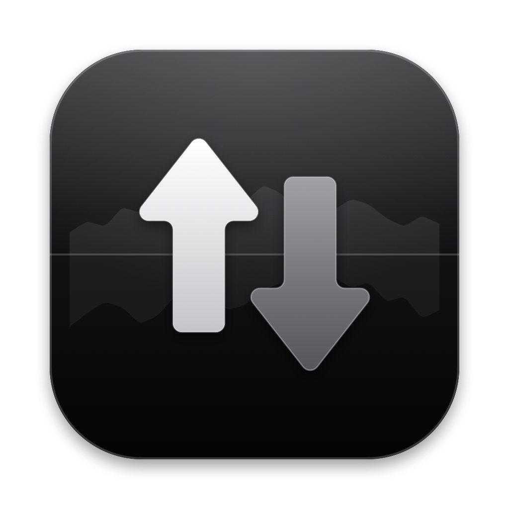

<p align="center">
  
</p>

<h1 align="center">MacNet</h1>

<p align="center">Live upload and download speed in your Mac's menu bar — compact, with a Liquid Glass panel and a built-in speed test.</p>

<p align="center">
  <a href="https://github.com/nisarganag/MacNet/releases/latest">
    </a>
  
  
  
  
  
</p>

---

MacNet lives only in the menu bar. It shows your current upload speed above your download speed in a label about 45 points wide — narrow enough to leave room on a 13-inch MacBook Air with a notch:

```
↑ 3.0 K/s
↓  50 K/s
```

Click it to open a Liquid Glass panel with:

- **Live traffic** — upload and download speed with a mirrored graph of the last 60 readings (one minute at the default 1-second interval).
- **Data used since launch.**
- **Internet speed test** — download, upload, latency and Apple's responsiveness rating, measured with macOS's built-in `networkQuality` tool against Apple's servers.
- **Settings** — start at login, update interval (1, 2 or 5 seconds), bytes (`K/s`) or bits (`Kb/s`), and frosted or clear glass.

## Install

1. Download `MacNet-x.y.z.dmg` from the [latest release](https://github.com/nisarganag/MacNet/releases/latest).
2. Open it and drag **MacNet** into **Applications**.
3. MacNet is signed ad hoc, not notarized, so the first launch is blocked. Open **System Settings ▸ Privacy & Security** and click **Open Anyway** next to the MacNet message. Or run:

   ```sh
   xattr -dr com.apple.quarantine /Applications/MacNet.app
   ```

Requires macOS 26 Tahoe or later, on Apple silicon or Intel.

**Don't see the icon?** When the menu bar is full, macOS hides items that don't fit beside the notch, and menu bar managers such as Bartender or Ice put new items in their hidden section. Drag MacNet into the visible area.

## How it measures

- **Menu bar speeds** come from the kernel's 64-bit per-interface byte counters, summed over Wi-Fi, Ethernet and cellular interfaces. VPN tunnels are skipped so their traffic isn't counted twice. Units step by 1000, like Finder.
- **Speed tests** run `/usr/bin/networkQuality`. Results are shown in decimal megabits per second, the unit ISPs advertise. A test takes about 30 seconds and transfers a few hundred megabytes.

MacNet collects nothing and sends nothing anywhere, apart from the speed test traffic you start yourself.

## Build from source

You need macOS 26 or later and Swift 6.2 or later. The Xcode Command Line Tools are enough.

```sh
make test      # unit tests
make run       # build and run from dist/
make install   # build, copy to /Applications and launch
make dmg zip   # distributable archives in dist/
```

The build uses the macOS 26.5 SDK when it's present. Under the Command Line Tools, the macOS 27 SDK can't compile SwiftUI's `@State`. To use a different SDK, run `make SDKROOT=…`.

## Releasing

Versions come from git tags. The app's version is the release tag it was built from, and the build number is the commit count.

```sh
make release              # 1.0.0 → 1.0.1   (the first release is 1.0.0)
make release BUMP=minor   # 1.0.1 → 1.1.0
make release BUMP=major   # 1.1.0 → 2.0.0
```

`make release` runs from a clean `main`. In order, it:

1. Runs the tests.
2. Builds a universal DMG and zip.
3. Installs the new version into `/Applications`.
4. Tags `vX.Y.Z` and pushes it.
5. Publishes the GitHub release with both archives.

It never creates commits. Release notes are the commit subjects since the previous tag. To use your own, run `RELEASE_NOTES=/tmp/notes.md make release`, and keep the file outside the repository, because the release needs a clean working tree. To check what would happen without changing anything, run `DRY_RUN=1 make release`.

## License

[MIT](LICENSE)

---

<p align="center">Made with ❤️ by Nisarga</p>
